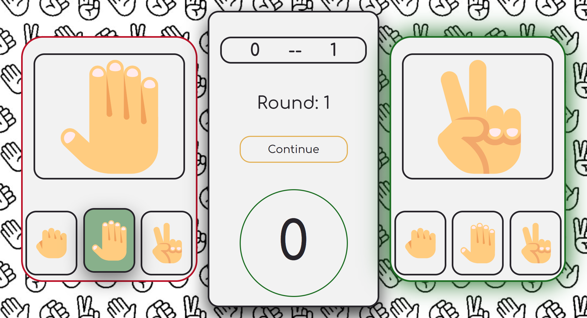

<h1 align="center">Rock Paper Scissors</h1>

## Overview



This is a practice created using JS without frameworks, which is the "Rock Paper Scissors" game. You can play against the machine and select the number of rounds. Click [HERE](https://brandonsdvl.github.io/RPS/) to visit it.

## How To Use

To clone and run this application, you'll need [Git](https://git-scm.com), [Node.js](https://nodejs.org/en/download/) (npm), [Gulp](https://gulpjs.com/docs/en/getting-started/quick-start/) and [Babel](https://babeljs.io/docs/en/babel-cli) installed on your computer. From your command line:

```bash
# Clone this repository
$ git clone https://github.com/BrandonSdvl/RPS.git

# Install dependencies
$ npm install

# Run server
$ gulp
```
